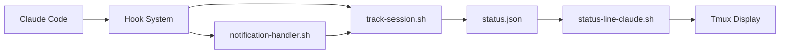

# Tmux Configuration Documentation

This document covers the complete tmux setup in this dotfiles repository, including the sophisticated Claude Code integration system.

## Overview

This tmux configuration provides:
- **Custom status bar with Claude Code integration** - Real-time session tracking and adaptive display
- **Advanced clipboard integration** - Universal clipboard via `rclip` with remote support
- **Smart pane navigation** - Vim-aware navigation and plugin ecosystem
- **Session management** - Auto-save/restore with tmux-resurrect and tmux-continuum
- **Remote session support** - SSH-optimized configuration and nested session handling

## Configuration Structure

```
tmux/
├── tmux.conf              # Main configuration file
├── custom-status.conf     # Claude integration + status bar
├── tmux.remote.conf      # SSH/remote session optimizations
├── .tmux.reset.conf      # Clean slate configuration reset
├── CLAUDE.md             # Claude Code integration documentation
├── scripts/              # Status bar scripts and utilities
│   ├── status-line-main.sh      # System monitoring (CPU, memory)
│   ├── status-line-claude.sh    # Claude session tracking
│   ├── cpu-simple.sh            # Cached CPU monitoring
│   ├── mem-simple.sh            # Cached memory monitoring
│   ├── host-icon.sh             # System icon detection
│   ├── hostname-display.sh      # Smart hostname formatting
│   └── tmux-command-palette.sh  # Command palette popup
├── plugins/              # TPM plugin directory
├── resurrect/           # Session save data
└── tmux-commands/       # Custom command scripts
```

## Claude Code Integration

### Real-Time Status Bar

The crown jewel of this configuration is the **adaptive status bar** that integrates directly with Claude Code sessions:

```
Line 1: [Host Icon] [Session] [Windows]              [CPU] [Memory] [Hostname]
Line 2: Sessions: dotfiles:🧠 website:⏳ api:🤔 │ 3 active
```

**Key Features:**
- **Automatic mode switching**: 1-line ↔ 2-line based on Claude session activity
- **Real-time status tracking**: 🚀 starting, 🧠 working, 🤔 asking, ⏳ waiting, 💤 idle
- **Multi-project support**: Track Claude sessions across different projects
- **Smart grouping**: Sessions grouped by project directory, not tmux session name
- **Current session highlighting**: Active session shown in blue, others dimmed

### Hook Integration Architecture



**Hook Events:**
- `SessionStart` → Creates session entry, switches to 2-line mode
- `PostToolUse` → Updates status to "working" 🧠
- `Notification` → Updates to "asking" 🤔 (permission requests)
- `Stop` → Updates to "waiting" ⏳
- `SessionEnd` → Updates to "idle" 💤, eventually 1-line mode

### Status File Format

Central state stored in `~/.claude/sessions/status.json`:

```json
{
  "sessions": [
    {
      "tmux_session": "dotfiles",
      "tmux_window": 1,
      "tmux_pane": 0,
      "project_dir": "/Users/user/.dotfiles",
      "status": "working",
      "last_activity": "2024-09-02T21:30:00Z",
      "claude_session_id": "session-123",
      "created_at": "2024-09-02T21:25:00Z"
    }
  ]
}
```

## Key Bindings Reference

### Prefix Key: `Ctrl+S`

#### Session & Window Management
| Key | Action | Description |
|-----|--------|-------------|
| `Ctrl+C` | `new-session` | Create new tmux session |
| `c` | `new-window` | Create new window in current directory |
| `x` | `kill-pane` | Kill current pane |
| `X` | `kill-window` | Kill current window |
| `Q` | `kill-session` | Kill current session (with confirmation) |

#### Pane Operations
| Key | Action | Description |
|-----|--------|-------------|
| `\|` | `split-window -h` | Split pane horizontally |
| `-` | `split-window -v` | Split pane vertically |
| `_` | `split-window -fv` | Full-width vertical split |
| `z` | `resize-pane -Z` | Zoom/unzoom pane |
| `B` | `break-pane` | Break pane out to new window |
| `E` | `join-pane` | Join pane from another window |

#### Pane Navigation (Vim-aware)
| Key | Action | Description |
|-----|--------|-------------|
| `Ctrl+H` | `select-pane -L` | Move to left pane (or vim split) |
| `Ctrl+J` | `select-pane -D` | Move to pane below (or vim split) |
| `Ctrl+K` | `select-pane -U` | Move to pane above (or vim split) |
| `Ctrl+L` | `select-pane -R` | Move to right pane (or vim split) |

#### Pane Resizing
| Key | Action | Description |
|-----|--------|-------------|
| `Left/Right/Up/Down` | `resize-pane` | Resize pane by 5 units |
| `Ctrl+H/J/K/L` | `resize-pane` | Resize pane by 5 units (vim-style) |

#### Copy Mode & Clipboard
| Key | Action | Description |
|-----|--------|-------------|
| `Enter` | `copy-mode` | Enter copy mode |
| `Ctrl+[` | `copy-mode` | Enter copy mode (alternative) |
| `v` | `begin-selection` | Start selection (in copy mode) |
| `y` | `copy-pipe-and-cancel 'rclip'` | Copy selection to clipboard |
| `Y` | `copy-line` | Copy entire line |

#### Status Bar Controls (Claude Integration)
| Key | Action | Description |
|-----|--------|-------------|
| `S` | Toggle Claude line | Hide/show Claude sessions line |
| `R` | Reload config | Reload status configuration |
| `I` | Status info | Show debug information |

#### Plugin & Tool Shortcuts
| Key | Action | Description |
|-----|--------|-------------|
| `j` | Command palette | Open tmux command palette popup |
| `?` | Cheatsheet | Show tmux cheatsheet popup |
| `o` | SessionX | Open session manager |
| `u` | FZF URL | Open URL finder |
| `g` | Lazygit | Open lazygit in new window |
| `l` | Glow | Open glow markdown viewer |

#### Remote Session Controls
| Key | Action | Description |
|-----|--------|-------------|
| `Ctrl+]` | Toggle nested mode | Enable/disable outer tmux for nested sessions |
| `r` | Reload config | Source tmux.conf and display message |

#### Window Management
| Key | Action | Description |
|-----|--------|-------------|
| `Ctrl+Shift+Left` | Move window left | Swap window with previous |
| `Ctrl+Shift+Right` | Move window right | Swap window with next |

## Plugin Ecosystem

### Core Plugins

#### TPM (Tmux Plugin Manager)
- **Purpose**: Plugin management system
- **Installation**: Auto-installs on first tmux start
- **Controls**: `Alt+I` (install), `Alt+U` (update), `Alt+X` (clean)

#### tmux-sensible
- **Purpose**: Sensible default settings
- **Features**: Better defaults for escape time, status interval, etc.

### Session Management

#### tmux-resurrect
- **Purpose**: Save and restore tmux sessions, windows, and panes
- **Storage**: `~/.dotfiles/tmux/resurrect/`
- **Processes**: Saves ssh, vi, vim, nvim, man, tail, top, htop states

#### tmux-continuum
- **Purpose**: Automatic session save/restore
- **Settings**: 
  - Auto-restore: Enabled on tmux start
  - Save interval: Every 15 minutes
  - Works seamlessly with resurrect

### Navigation & Search

#### tmux-sessionx
- **Purpose**: Advanced session manager with fuzzy search
- **Binding**: `Prefix + o`
- **Features**: zoxide integration for directory-based session creation

#### tmux-floax
- **Purpose**: Floating window management
- **Features**: Create popup-style floating panes

#### tmux-fzf-url
- **Purpose**: Quick URL opening from terminal output
- **Binding**: `Prefix + u`
- **Features**: Scan terminal for URLs and open with fzf selection

#### tmux-menus
- **Purpose**: Context menus for tmux operations
- **Features**: Right-click or keyboard-driven menus

### Visual Enhancements

#### tmux-prefix-highlight
- **Purpose**: Show prefix key activation in status bar
- **Integration**: Works with custom status bar

## Clipboard Integration

### Universal Clipboard via rclip

The configuration uses `rclip` for all clipboard operations, providing seamless clipboard sharing across:
- Local tmux sessions
- Remote SSH sessions  
- Nested tmux sessions
- Different operating systems

**Key features:**
- Automatic fallback to OSC52 when remote bridge unavailable
- All copy operations (`y`, `Y`, mouse selection) use rclip
- Works in both vi and emacs copy modes
- Handles double/triple-click selection

### Copy Mode Bindings

**Vi mode** (default):
- `v`: Start selection
- `Ctrl+V`: Rectangle selection
- `y`: Copy selection and exit copy mode
- `Y`: Copy entire line
- `Enter`: Copy selection and exit

**Mouse operations**:
- Double-click: Select word and copy
- Triple-click: Select line and copy
- Drag selection: Automatically copies on release

## Remote Session Support

### SSH Optimization

When connecting via SSH, `tmux.remote.conf` is automatically loaded:

**Features:**
- OSC52 clipboard integration enabled
- SSH agent socket management
- Dynamic environment updates
- Status position adjustment for remote context

### SSH Agent Management

**Automatic refresh hooks:**
- Session creation, client attachment, pane focus events
- Maintains persistent SSH agent connection
- Uses symlinked socket at `~/.ssh/ssh_auth_sock`

**Manual refresh:**
- `Prefix + R`: Find working SSH agent and refresh connection

### Nested Session Handling

**Toggle nested mode:**
- `Ctrl+]`: Disable outer tmux to access inner tmux
- `Ctrl+]` (again): Re-enable outer tmux

**Visual feedback:**
- Status bar changes color when nested mode active
- Clear indication of which tmux layer is active

## System Monitoring

### CPU Monitoring
- **Script**: `scripts/cpu-simple.sh`
- **Cache**: 3-second TTL in `~/.cache/tmux-cpu`
- **Algorithm**: `busy_cpu = 100 - idle_cpu`
- **Platforms**: macOS (via `top`), Linux (via `top` or `iostat`)

### Memory Monitoring  
- **Script**: `scripts/mem-simple.sh`
- **Cache**: 5-second TTL in `~/.cache/tmux-mem`
- **macOS**: `memory_pressure` or `vm_stat` fallback
- **Linux**: `/proc/meminfo` parsing
- **Format**: Human-readable (8.2G, 512M, 2048K)

### Host Information
- **Icon detection**: System-specific icons (MacBook, iMac, Linux)
- **Hostname display**: Smart formatting with SSH context
- **Caching**: Expensive operations cached appropriately

## Performance Optimizations

### Efficient Scripting
- **Aggressive caching**: All monitoring scripts use cached values
- **Cross-platform compatibility**: Handles macOS/Linux differences
- **Minimal dependencies**: Uses built-in tools where possible
- **Error handling**: Graceful degradation when tools unavailable

### Cache Management
```bash
# Cache locations and TTLs
~/.cache/tmux-cpu        # 3 seconds
~/.cache/tmux-mem        # 5 seconds  
~/.cache/tmux-host-icon  # 1 hour
~/.cache/tmux-hostname   # 5 minutes
```

### Smart Refresh Triggers
```bash
# Multiple refresh mechanisms
set -g status-interval 5                    # Base refresh rate
set-hook -g session-created 'refresh-client -S'     # New session
set-hook -g session-closed 'refresh-client -S'      # Session end  
set-hook -g client-session-changed 'refresh-client -S'  # Switch
```

## Color Scheme (Catppuccin Mocha)

| Color | Hex | Usage |
|-------|-----|-------|
| Blue | `#89b4fa` | Active elements, current session |
| Green | `#a6e3a1` | Memory info, success states |
| Yellow | `#f9e2af` | CPU info, warnings |
| Red | `#f38ba8` | Errors, critical status |
| Dim | `#6c7086` | Inactive elements |
| Text | `#cdd6f4` | Primary text |
| Surface | `#313244` | Separators, borders |

## Installation & Setup

### Prerequisites
- **tmux 3.0+** (3.3+ recommended for advanced formatting)
- **jq** (required for Claude integration JSON processing)
- **rclip** (universal clipboard tool)
- **bash 4.0+** (advanced regex, associative arrays)

### Installation Steps

1. **Install via dotbot**:
```bash
./install-standalone tmux
```

2. **Manual plugin installation** (if needed):
```bash
git clone https://github.com/tmux-plugins/tpm ~/.dotfiles/tmux/plugins/tpm
~/.dotfiles/tmux/plugins/tpm/bin/install_plugins
```

3. **Start tmux**:
```bash
tmux
```

Plugins will auto-install on first start, and Claude integration will activate when Claude Code is used.

## Troubleshooting

### Status Bar Issues

**Claude line not showing:**
```bash
# Check session tracking
cat ~/.claude/sessions/status.json | jq '.'

# Test scripts individually
~/.dotfiles/tmux/scripts/status-line-claude.sh
~/.dotfiles/tmux/scripts/status-line-main.sh
```

**Performance problems:**
```bash
# Check cache files
ls -la ~/.cache/tmux-*

# Test script performance  
time ~/.dotfiles/tmux/scripts/cpu-simple.sh
```

### Plugin Issues

**Plugins not loading:**
```bash
# Reinstall TPM
rm -rf ~/.dotfiles/tmux/plugins/tpm
git clone https://github.com/tmux-plugins/tpm ~/.dotfiles/tmux/plugins/tpm

# Install plugins
~/.dotfiles/tmux/plugins/tpm/bin/install_plugins
```

### Remote Session Problems

**SSH agent not working:**
```bash
# Manual refresh
tmux send-prefix \; send-keys R

# Check socket
ls -la ~/.ssh/ssh_auth_sock
```

**Clipboard not syncing:**
```bash
# Test rclip
echo "test" | rclip

# Check remote bridge status
remote-bridge status
```

### General Debugging

```bash
# Show current tmux options
tmux show-options -g | grep status

# Test configuration syntax
tmux source-file ~/.dotfiles/tmux/tmux.conf

# Check tmux version
tmux -V
```

## Maintenance

### Regular Tasks
- **Plugin updates**: `Alt+U` in tmux session
- **Session cleanup**: Automatic via continuum (24-hour retention)
- **Cache cleanup**: Automatic via system (respects TTL)

### Configuration Updates
- **Reload config**: `Prefix + r`
- **Status bar changes**: Automatically picked up every 5 seconds
- **Plugin changes**: Requires tmux restart

### Log Monitoring
- **Session tracking**: `~/.claude/sessions/tracker.log`
- **Hook debugging**: `/tmp/claude-hook-debug.log`
- **Plugin logs**: Individual plugin directories

---

This tmux configuration represents a sophisticated terminal multiplexer setup with deep Claude Code integration, providing real-time workflow awareness and seamless multi-environment operation. The adaptive status bar and intelligent session tracking make it particularly powerful for development workflows involving Claude Code.